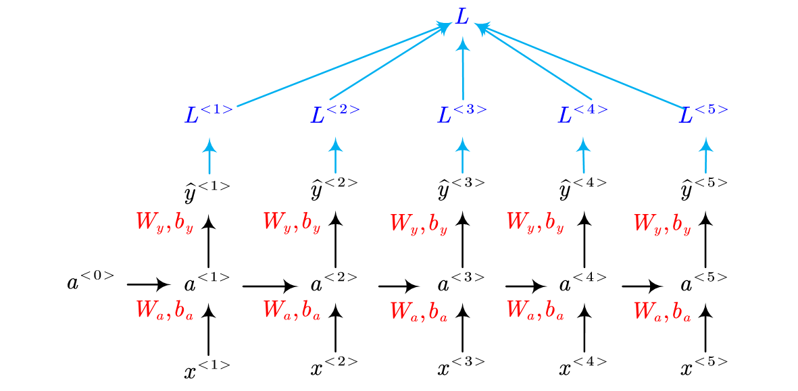
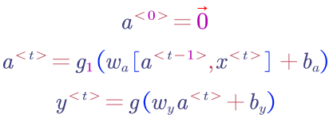
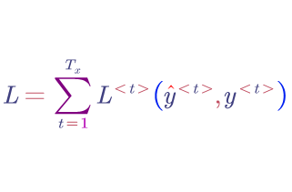
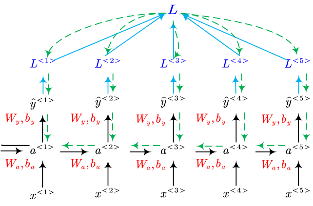
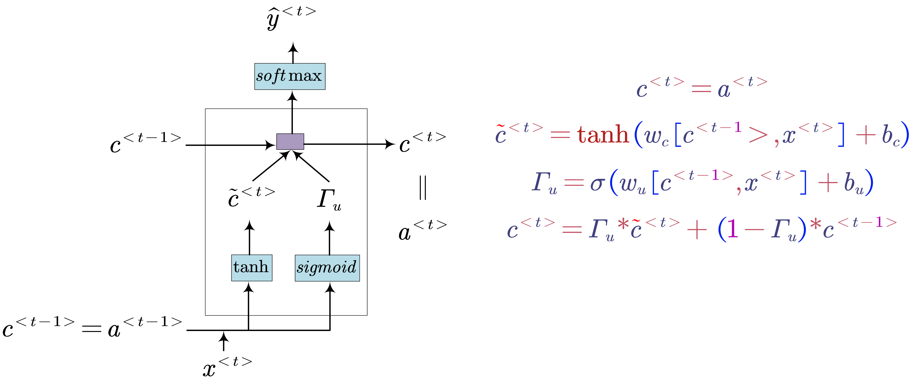
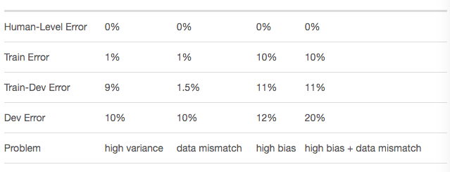
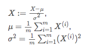
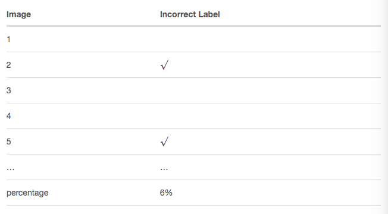

# 内容目录

* [激活函数](1.Activation%20Functions/激活函数.md)
* [梯度下降](2.Gradient%20Descent/梯度下降.md)
  * [计算图](2.Gradient%20Descent/梯度下降.md/#计算图)
  * [反向传播算法](2.Gradient%20Descent/梯度下降.md/#反向传播算法)
  * [L2正则修正的梯度（权重衰减）](2.Gradient%20Descent/梯度下降.md/#l2正则修正的梯度权重衰减)
  * [梯度消失和梯度爆炸](2.Gradient%20Descent/梯度下降.md/#梯度消失和梯度爆炸)
  * [小批量梯度下降](2.Gradient%20Descent/梯度下降.md/#小批量梯度下降)
  * [随机梯度下降](2.Gradient%20Descent/梯度下降.md/#随机梯度下降)
  * [小批量梯度下降批次大小选择](2.Gradient%20Descent/梯度下降.md/#小批量梯度下降批次大小选择)
  * [Momentum](2.Gradient%20Descent/梯度下降.md/#Momentum)
  * [RMSprop](2.Gradient%20Descent/梯度下降.md/#RMSprop)
  * [Adma](2.Gradient%20Descent/梯度下降.md/#Adma)
  * [学习率衰减](2.Gradient%20Descent/梯度下降.md/#学习率衰减)
  * [批量归一化](2.Gradient%20Descent/梯度下降.md/#批量归一化)
* [参数](3.Parameters/参数.md)
  * [可学习参数和超参数](3.Parameters/参数.md/#可学习参数和超参数)
  * [参数初始化](3.Parameters/参数.md/#参数初始化)
  * [超参数调优](3.Parameters/参数.md/#超参数调优)
* [模型](5.Models/模型.md)
    * [序列模型](5.Models/模型.md/#序列模型)

----

# 激活函数

函数 | 表达式 |  导数
--- | --- | ---
sigmoid |  $g(z) = \frac{1 }{ 1 + e^{(-z)}}$ | $g(z)(1- g(z))$
tanh | $ tanh(z)$ | $ 1 - (tanh(z))^2 $
Relu | $max(0,z)$ | $ 0,if (z < 0)  \\ 未定义, if (z = 0) \\ 1, if (z > 0) $
Leaky Relu | $max (0.01z,z)$ | $0.01，if (z <  0) \\ 未定义， if (z = 0)  \\ 1 ，if (z > 1)$

> 常见的激活函数包括三类：
> - S型曲线
> - 修正线性单元（ReLU）
> - Maxout单元
> 
> 激活函数需要具备的特点：
> - 连续并可导的非线性函数，可导的激活函数可以直接利用数值优化的方法来学习网络参数
> - 激活函数及其导函数要尽可能的简单，有利于提高网络计算效率
> - 激活函数的导函数的值域要在一个合适的区间内，不能太大也不能太小，否则会影响训练的效率和温度性

# 梯度下降
梯度下降是求解目标函数局部最小值的一种迭代方法（如损失函数），其迭代的过程如下：
```
Repeat{
    W := W - learning_rate * dJ(W)/dW
}
```
符号$:=$表示覆盖操作。从公式中可以看出，在梯度下降求解过程中要不断的去更新$W$

通常用$\alpha$表示学习率，当训练神经网络时，它是一个很重要的超参数（更多关于超参数的介绍可参考下一节）。$J(W)$表示模型的损失函数，$ \frac{d J(W)}{d(W)} $是关于参数$W$的梯度，如果参数$W$是个矩阵，则$ \frac{d J(W)}{d(W)} $也会是一个矩阵。

**问题：为什么我们在最小化损失函数时不是加上梯度？**

答：假设损失函数是$J(W)=0.1 (W-5)^2$，如下图所示：


当参数$W=10$时，梯度$ \frac{d J(W)}{d(W)} = 0.1 * 2 (10-5) = 1$，很显然，如果继续寻找最小的损失函数$J(W)$时，梯度的反方向（eg:$-\frac{d J(W)}{d(W)} $）是找到局部最优点的正确方向（eg：$J(W=5)=0$）。

但需要注意的是，梯度下降法有时候会遇到局部最优解问题。


## 计算图

计算图的例子在[Deep Learning AI](https://www.deeplearning.ai/)的第一节课程中被提到。

假设有三个可学习的参数$a,b,c$，目标函数定位为：$J=3(a + bc)$，接下来我们要计算参数的梯度：$\frac {dJ}{da},\frac {dJ}{db},\frac {dJ}{dc}$，同时定义$u = bc,v = a+u,J =3v$，则计算过程可以转化为下边这样的计算图。


## 反向传播算法
从上图可以看出，参数的梯度为：$\frac {dJ}{da} = \frac{dJ}{dv} \frac {dv}{da}, \frac {dJ}{db} =\frac {dJ}{dv}\frac {dv}{du}\frac {du}{db}, \frac {dJ}{dc} =\frac {dJ}{dv}\frac {dv}{du}\frac {du}{dc} $。

计算每个节点的梯度比较容易，如下所示（这里需要注意的是：如果你要实现自己的算法，梯度可以在正向传播时计算，以节省计算资源和训练时间，因此当反向传播时，无需再次计算每个节点的梯度）。


现在可以通过简单的组合节点梯度来计算每个参数的梯度。


$\frac {dJ}{da} = \frac{dJ}{dv} \frac {dv}{da} = 3* 1 = 3$

$\frac {dJ}{db} =\frac {dJ}{dv}\frac {dv}{du}\frac {du}{db} = 3 * 1 * 2 = 6$

$\frac {dJ}{dc} =\frac {dJ}{dv}\frac {dv}{du}\frac {du}{dc} = 3 * 1 * 3 = 9$


## L2正则修正的梯度（权重衰减）
通过引入 $\frac {\lambda}{m} W$ 改变梯度的值。

```
Repeat{
    W := W - (lambda/m) * W - learning_rate * dJ(W)/dW
}
```

## 梯度消失和梯度爆炸
如果我们定义了一个非常深的神经网络且没有正确初始化权重，可能会遇到梯度消失或梯度爆炸问题（更多关于参数初始化的可以参考：[参数初始化](##参数初始化)。

这里以一个简单的但是深层的神经网络结构为例（同样，这个很棒的例子来自于线上AI课程：[Deep Learning AI](https://www.deeplearning.ai/)）来解释什么是梯度消失，梯度爆炸。

假设神经网络有$L$层，为了简单起见，每一层的参数$b^l$为0，所有的激活函数定义为：$g(z)=z$，除此之外，每层的连接权重$W^l$拥有相同的权重：$W^{[l]}=\left(\begin{array}{cc}
1.5 & 0\\
0 & 1.5
\end{array}\right)$。

基于上述的简单网络，最终的输出可能为：
$y=W^{[l]}W^{[l-1]}W^{[l-2]}…W^{[3]}W^{[2]}W^{[1]}X$

如果权重$W=1.5>1$，$1.5^L$将会在一些元素上引起梯度爆炸。同样，如果权重值小于1，将会在一些元素上引起梯度消失。 

**梯度消失和梯度爆炸会使模型训练变得十分困难，因此，正确初始化神经网络的权重十分重要。**

## 小批量梯度下降
如果训练集数据特别大，单个batch在训练时会花费大量的时间，这对开发者而言，跟踪整个训练过程会变得十分困难。在小批量梯度下降中，根据当前批次样本计算损失和梯度，在一定程度上能够解决该问题。

$X$代表整个训练集，它被划分成下面这样的多个批次，m表示的是训练集的样本数。


小批量梯度训练的过程如下：
```
For t= (1, ... , #批次大小):
    基于第t个批次进行前向传播计算;
    计算第t个批次的损失值;
    基于第t个批次进行反向传播计算，以计算梯度并更新参数.
```
在训练过程中，对比不应用小批量梯度下降和应用小批量梯度下降，前者下降的更加平滑。


## 随机梯度下降

随机梯度下降时，批次的样本数大小为1。

## 小批量梯度下降批次大小选择
小批量大小：
1. 如果批次大小为M，即整个训练集的样本数，则梯度下降恰好为批量梯度下降
2. 如果批次大小为1，则为随机梯度下降

实际应用中，批次大小是在$[1,M]$之间选择。如果$M \leq 2000$，该数据集是一个小型数据集，使用批量梯度下降是可以接受的。如果$M > 2000$，使用小批量梯度下降算法训练模型更加适合。通常小批量的大小设置为：64，128，256等。

下图为使用不同批次大小训练模型的下降过程。


## Momentum
> 神经网络中普遍使用的是小批量梯度下降优化算法，因此这里介绍的Momentum和下边介绍的RMSprop，Adma都是结合小批量梯度下降优化进行的。

增加动量法小批量梯度第$t$次迭代过程如下：
1. 基于当前的批次数据计算$dW,db$
2. $V_{dW}=\beta V_{dW}+(1-\beta)dW$
3. $V_{db}=\beta V_{db}+(1-\beta)db$
4. $W:=W-\alpha V_{dW}$
5. $b:=b-\alpha V_{db}$

动量法中的超参数为$\alpha, \beta$。在动量法中，$V_{dW}$是上一个批次的历史梯度数据。如果令$\beta=0.9$，这意味着要考虑最近10次迭代的梯度以更新参数。

$\beta$原本是来自[指数加权平均值](https://www.youtube.com/watch?v=NxTFlzBjS-4)的参数。例如：$\beta=0.9$意味着取最近10个值作为平均值，$\beta=0.999$意味着考虑最近1000次的结果。

## RMSprop
RMSprop的全称是Root Mean Square Prop，

在RMSprop优化算法下，第$t$个批次的迭代过程如下：
1. 基于当前的批次数据计算$dW,db$
2. $S_{dW}=\beta S_{dW}+(1-\beta)(dW)^2$
3. $S_{db}=\beta S_{db}+(1-\beta)(db)^2$
4. $W:=W -\alpha \frac{dW}{\sqrt{S_{dW}}+\epsilon}$
5. $b:=b-\alpha \frac{db}{\sqrt{S_{db}}+\epsilon}$


## Adma
> Adma全称是Adaptive Moment Estimation，自适应动量估计算法。可以看作是动量法和RMSprop的结合，不但使用动量作为参数更新，而且可以自适应调整学习率。

$V_{dW}=0, S_{dW=0},V_{db}=0, S_{db}=0$

在Adma优化算法下，第t个批次的迭代过程如下：

1). 基于当前的批次数据计算$dW,db$

// 动量法

2). $V_{dW}=\beta_1 V_{dW}+(1-\beta_1)dW$

3). $V_{db}=\beta_1 V_{db}+(1-\beta_1)db$

// RMSprop

4). $S_{dW}=\beta_2 S_{dW}+(1-\beta_2)(dW)^2$

5). $S_{db}=\beta_2 S_{db}+(1-\beta_2)(db)^2$

// 偏差校正

6). $V_{dW}^{correct}=\frac{V_{dW}}{1-\beta_1^t}$

7). $V_{db}^{correct}=\frac{V_{db}}{1-\beta_1^t}$

6). $S_{dW}^{correct}=\frac{S_{dW}}{1-\beta_2^t}$

7). $S_{db}^{correct}=\frac{S_{db}}{1-\beta_2^t}$

// 参数更新

$W:=W -\alpha \frac{V_{dW}^{correct}}{\sqrt{S_{dW}^{correct}}+\epsilon}$

$b:=b-\alpha \frac{V_{db}^{correct}}{\sqrt{S_{db}^{correct}}+\epsilon}$

"纠正"是指数加权平均的[偏差校正](https://www.youtube.com/watch?v=lWzo8CajF5s)的概念。纠正使得平均值的计算更加准确。$t$是$\beta$的幂。

通常，超参数的值为：$\beta_1 = 0.9$，$\beta_2 = 0.99$，$\epsilon=10^{-8}$

学习率$\alpha$需要进行调整的，当然也可以使用学习率衰减的方法，同样可以取得不错的效果。

## 学习率衰减

如果在训练期间固定学习率，如下图所示，损失或者目标可能会波动。因此寻找一种具备自适应调整的学习率会是一个很好的方法。


**基于Epoch的衰减**


根据epoch的值来降低学习率是一个直接方法，其衰减方程如下：
$$
\alpha=\frac{1}{1+DecayRate*EpochNumber}\alpha_0
$$

其中 DecayRate是衰减率，EpochNumber表示epoch的次数。

例如，初始学习率$\alpha=0.2$，衰减率为1.0，每次epoch的学习率为：
Epoch | $\alpha$
----| ---
1 | 0.1
2 | 0.67
3 | 0.5
4 | 0.4
5 | ...

也有一些其他的学习率衰减方法，如下：

方法 | 表达式
--- | ---
指数衰减 | $\alpha=0.95^{EpochNumber}\alpha_0$
基于epoch次数的衰减 | $\alpha=\frac{k}{EpochNumber}\alpha_0$
基于批量大小的衰减 | $\alpha=\frac{k}{t}\alpha_0$
“楼梯”衰减 | 
手动衰减 | 按照天或者小时手动衰减降低学习率


## 批量归一化

**训练时批量归一化**

批量标准化可以加快训练速度，步骤如下：


每个层$l$中，归一化的具体公式如下：

$\mu=\frac{1}{m}\sum Z^{(i)}$

$\delta^2=\frac{1}{m}\sum (Z^{(i)}-\mu)$

$Z^{(i)}_{normalized}=\alpha \frac{Z^{(i)}\mu}{\sqrt{\delta^2}+\epsilon} +\beta$

$\alpha, \beta$是可学习的参数。

**测试时批量归一化**

在测试时，因为每次可能只有一个测试的实例样本，所以没有充足的实例样本计算$\mu$ 和 $\delta$。

在这种情况下，最好使用跨批量的指数加权平均值来估计$\mu$ 和 $\delta$的合理值。

# 参数

## 可学习参数和超参数

**可学习参数**

$W,b$
> 例如 一元一次方程 $ y = Wx + b$ 中的 $W,b$ 就是根据训练集自学习的参数。在神经网络中，$W$通常表示权重向量$[w_1, w_2...,w_n]$，$b$通常表示偏置。

**超参数**

- 学习率 $\alpha$ 
- 迭代次数
- 神经网络层数$L$
- 隐藏层每一层的单元个数
- 激活函数
- 动量法的参数
- 小批量梯度下降优化算法的批大小
- 正则化参数

> 神经网络采用的是小批量梯度下降优化算法。动量法是梯度下降方向优化的方法。

## 参数初始化

**小值初始化**

在初始化参数$W$时，通常将其初始化为比较小的值。比如在Python中这样实现：
``` 
W = numpy.random.randn(shape) * 0.01
```

进行小值初始化的原因是，当使用的激活函数为Sigmoid时，如果权重过大，在进行反向传播计算时会导致梯度很小，可能引起梯度消失问题。

**结合网络单元数的小值的权重初始化**

同样，我们使用伪代码的方法表示各种初始化的工作方式。当隐藏层网络单元的个数很大时，更加倾向于使用较小的值进行权重初始化，防止训练时梯度消失或梯度爆炸。如下图这样：


基于上述的思路，可以结合隐藏层单元的个数对权重进行初始化，Python表达如下：
```
W = numpy.random.randn(shape) * numpy.sqrt(1/n[l-1])
```
其对应的数学表达式为：$ \sqrt {\frac {1 }{n^{l-1}}}$,$n^{l-1}$表示第$l-1$层的神经元个数，如果选用的是ReLU激活函数，对应的数学表达式为：$ \sqrt {\frac {2 }{n^{l-1}}}$。


**Xavier初始化**

如果在神经网络中你使用的激活函数是tanh，使用Xavier进行权重初始化能够取得不错的效果，Xavier的公式如下：$\sqrt { \frac{1 }{ n^{l-1}} }$或者$\sqrt { \frac{ 2 }{ n^{l-1} + n^l} }$（其中$n^{l-1}$表示第$l-1$层的神经元个数，$n^l$表示第$l$层的神经元个数）。

> 不同文献中 Xavier初始化的表达式不同，但大同小异，改变的只是根号下分子部分，最终不会改变参数的分布。

## 超参数调优
当训练超参数时，尝试参数所有的可能取值是必要的，如果在资源允许的情况下把不同的参数值传给同一个模型进行并行训练是最简单的方法。但是事实上，资源是很有限的，在这种情况下，同一时间，我们只能训练一个模型，并在不同时间尝试不同参数。


除了上述介绍的，如何选择合适的超参数也是非常重要的。

在神经网络中都很多超参数，比如：学习率$\alpha$，动量法和RMSprop的参数($\beta _1,\beta _2,\epsilon$)，神经网络层数，每一层的单元数，学习率衰减参数，批训练的批大小。

Andrew Ng提出了相关参数的优先级，如下：
优先级 | 超参数
--- | ---
1 | 学习率$\alpha$
2 | $\beta _1,\beta _2,\epsilon$(动量法和RMSprop的参数)
2 | 隐藏层单元数
2 | 批训练的批大小
3 | 网络层数
3 | 学习率衰减系数

通常默认的动量法和RMSprop的参数为：$ \beta _1 = 0.9, \beta _2 = 0.99,\epsilon = 10^{-8} $

**隐藏层和网络单元的均匀采样**

例如，神经网络层范围是[2,6]，我们可以均匀的尝试2，3，4，5，6去训练模型。同样网络单元范围是[50,100]，在这个范围内进行尝试也是一个好的策略。表示如下：


**对数采样**

或许，你已经意识到均匀采样对于所有类型的参数不是一个好方法。

例如，我们认为学习率$\alpha \in [0.0001,1] = [10^{-4},10^0]$是一个合适的范围。很显然，均匀采样是不合理的，一种更合适的方法是进行对数采样，$\alpha= 10^r,r\in [-4,0] (0.0001, 0.001, 0.01, 0.1,1)$。

对于参数$\beta _1, \beta _2$，可以采用相同的策略。

例如：$1- \beta= 10 ^r$，因此$\beta = 1- 10^r$,$r \in [-3,-1]$

下面的这个表格，能够帮你更好的理解这种策略

$\beta$ | 0.9 | 0.99 | 0.999
--- | ---| --- | ---
$1 - \beta$ | 0.1 | 0.01 | 0.001
$r$ | -1 | -2 | -3

例如：


# 序列模型

## 循环神经网络RNN

前向传播：



图中红色的参数W和b是可学习变量，每一个时间步结束时，计算该步的损失Loss，最后，每一步的所有损失之和为整个序列的总损失L，

下面是每一步的公式:



总损失为：



反向传播算法BPTT（Backpropagation Through Time）示意图：



## 门控循环单元Gated Recurrent Unit (GRU)

### 简化版GRU（Simplified）



### 原始GRU（full）


### 长短期记忆网络LSTM


### 嵌入矩阵（Embedding Matrix） $E$


$ UNK $表示未知词，所有识别到不在词库里面的单词都会强制转换为$ UNK $。 矩阵由$ E $表示。 如果我们想获取一个单词的词嵌入向量，我们可以如下图所示利用单词的one-hot向量进行转化：


通常，可以将其公式化为：
$$
E \cdot O_j = e_j (embedding \quad for \quad j )
$$

### 学习词嵌入（Learning Word Embedding）


在模型中，嵌入矩阵（即$E$）与其他参数（即$w$和$b$）一样是可学习的。 所有可学习的参数都以蓝色突出显示。

该模型的总体思想是在给定上下文的情况下预测目标单词。 在上图中，上下文是最后4个单词（即a，glass，of，橙色），目标单词是“ to”。

另外，有多种方法可以定义目标词的上下文，例如：

- 最后$n$个字
- $n$个单词左右目标单词
- 附近的一个字（skip-gram的思想）
- …

### Word2Vec & Skip-gram

假设有一个句子“I want a glass of orange juice to go along with my cereal.”

在此词嵌入学习模型中，上下文（context）是从句子中随机选择的词，目标（target）是用上下文单词的窗口随机拾取的单词。

例如，我们现在将“orange”作为上下文单词，我们能得到下面的训练样本：


模型是这样的：


Softmax函数可以被定义为如下形式：


$\theta$是与输出有关的一个参数，$e_c$是当前上下文单词的embedding形式。

然而使用softmax函数的问题分母的计算成本太大，原因是我们的词汇量可能很大。 为了减少计算量，负采样是不错的解决方案。

### 负采样（Negative Sampling）

假设有一个句子“I want a glass of orange juice to go along with my cereal.”

给定一对单词（即上下文单词和另一个单词）和标签（即第二个单词是否为目标单词）。 如下图所示，（orange juice 1）是一个正样本，因为单词juice是orange的真正目标单词。 由于所有其他单词都是从词典中随机选择的，因此这些单词被视为错误的目标单词。 因此，这些对是负样本（偶然将真实的目标单词选作否定示例是可以接受的）。


至于每个上下文单词对应的错误单词的数量$K$，在样本量较少的情况下，$K$选择在5-20之间，如果样本量较大，$K$选择在2-5之间。

模型如下：


我们只能训练softmax函数的$K+1$个逻辑斯蒂回归模型，所以计算量会低很多。

那么如何筛选负样本呢？模型如下：


$f(w_i)$是词频。

如果使用第一个样本分布，则可能总是选择诸如 “the”、“a”、“of”等之类的词。但是，如果使用第三个分布，则所选的词将是非代表性的。 因此，第二分布可以被认为是用于采样的更好的分布。 这种分布在第一个和第三个之间。

### GloVe 向量

符号: $X_{ij}= 词汇_i出现在上下文j的数量$。

模型如下：


$X_{ij}$衡量两个词的相关性以及两个词同时出现的频率（共现性）。$f(X_{ij})$是权重模块，它给高频词汇对（两两匹配衡量$X_{ij}$）带来了不太高的权重，也给了不太常见的词汇对带来了不太小的权重。

如果我们仔细看$\theta$和$e$，会发现其实他们起到的作用一样，所以最终单词的词嵌入形式为：


### 深度上下文化的词表示形式（ELMo）

*预训练双向语言模型*

前向语言模型：给地方给你一个长度为$N$D的序列$(t_1,t_2,...,t_N)$，前向语言模型通过对$t_k$的概率来建模计算序列的概率，即：


后向语言模型类似：


双向语言模型融合了上述两者，同时最大化前向和后向概率。


LSTM被用于前向和后向语言模型建模中。


就输入嵌入而言，我们可以只初始化这些嵌入或使用预先训练的嵌入。 对于ELMo，使用字符嵌入和卷积层会更加复杂，如下所示。


训练语言模型后，我们可以将得到单词在这个句子中的ELMo嵌入。


在ELMo中，$s$是经过softmox标准化的权重，$\gamma$是一个能根据任务模型缩放整个ELMo的缩放向量。这些参数可以在特定任务模型训练期间进行训练。

参考文献：
[1] https://www.slideshare.net/shuntaroy/a-review-of-deep-contextualized-word-representations-peters-2018
[2] http://jalammar.github.io/illustrated-bert/
[3] https://www.mihaileric.com/posts/deep-contextualized-word-representations-elmo/


## translation 模型
####逻辑回归
给定输入实例的特征向量$x$，则逻辑回归模型的输出可表示为$p(y=1|x)$。相应的有$p(y=0|x)=1-p(y=1|x)$。逻辑回归中需要训练的参数包括权重$W$和偏差项$b$。

$p(y=1|x)=\sigma(W^Tx+b)=(1+e^{-W^T-b})^{-1}$

下图中$x$轴表示$W^Tx+b$的值，$y$轴表示$p(y=1|x)$。(图片来自[wikipedia](https://en.wikipedia.org/wiki/Sigmoid_function))

<center>
    
    <br>
    <div style="color: #999;
    font-size:11px;
    padding: 2px;">sigmoid</div>
</center>

对于一个输入实例$(x^i,y^i)$，其损失函数为：

$LogLikelihood=\sum_{i=1}^{m}logP(y^i|x^i)=\sum_{i=1}^{m}log(\hat{y}^y(1-\hat{y})^{1-y})=-\sum_{i=1}^{m}L(\hat{y}^i,y^i)$

其中$\hat{y}^i$为预测值，$y^i$为真实标签。

对于全部训练数据而言，损失函数可以表示为：($m$是训练样本量)
$J(W,b)=\frac{1}{m}\sum_{i=1}^{m}L(\hat{y}^i,y^i)$

最小化损失函数实际上就等价于最小化似然函数：

$LogLikelihood=\sum_{i=1}^{m}logP(y^i|x^i)=\sum_{i=1}^{m}log(\hat{y}^y(1-\hat{y})^{1-y})=-\sum_{i=1}^{m}L(\hat{y}^i,y^i)$
</br>
####多分类(softmax回归)
softmax回归就是将逻辑回归(二分类)推广到多个类别的情形，即多分类模型。
<center>
    
    <br>
    <div style="color: #999;
    font-size:11px;
    padding: 2px;">softmax</div>
</center>

</br>
如上图所示的一个3分类神经网络。在最后一层使用softmax激活函数输出每个类的概率。

softmax激活函数的数学描述如下所示：

1).$z^{[L]}=[z^{[L]}_0, z^{[L]}_1, z^{[L]}_2]$

2).$a^{[L]}=[\frac{e^{z^{[L]}_0}}{e^{z^{[L]}_0}+ e^{z^{[L]}_1}+e^{z^{[L]}_2}}, \frac{e^{z^{[L]}_1}}{e^{z^{[L]}_0}+e^{z^{[L]}_1}+ e^{z^{[L]}_2}}, \frac{e^{z^{[L]}_2}}{e^{z^{[L]}_0}+ e^{z^{[L]}_1}+e^{z^{[L]}_2}}]$

$=[p(class=0|x),p(class=1|x),p(class=2|x)]$
$=[y_0,y_1,y_2]$

损失函数为：
$LossFunction=\frac{1}{m}\sum_{i=1}^{m}L(\hat{y^i},y^i)$
$L(\hat{y},y)=-\sum_j^{3}y_j^i\log\hat{y_j^i}$

其中$m$是训练样本量，$j$表示第$j$个类。
</br>
####迁移学习
如果我们有较多的训练数据或者是我们的神经网络非常庞大的话，通常来说训练这样一个模型是非常耗时的（可能需要好几天或者好几周的时间）。值得庆幸的是，现在有非常多的预训练模型可供我们使用。通常，这些预训练模型都是在比较庞大的数据量上训练出来的。

迁移学习的主要思路就是我们可以下载这些预训练模型并且把它们调整用于我们自己的机器学习任务。如下图所示。

<center>
    
    <br>
    <div style="color: #999;
    font-size:11px;
    padding: 2px;">迁移学习</div>
</center>
在数据量较多的情形下，我们可以重新训练整个神经网络。但如果我们可用的训练数据非常少的话，我们可以仅训练神经网络最后一层或者几层。

**在什么场景下我们可以使用迁移学习？**
假设：
预训练模型针对的是任务A，我们的模型针对的是任务B。

- 两个任务应该有着同样的输入形式
- 任务A有着大量的训练数据。但任务B的训练数据量非常少。
- 任务A学到的浅层特征对于训练任务B非常有帮助。

#### 多任务学习
如下所示，在一个分类任务中，通常每个输入实例有且仅有一个标签：
$y^{(i)} =\begin{pmatrix}0\\1\\0\\0\\0\end{pmatrix}$

但是在多任务学习中，一个输入实例可以有多个标签：
$y^{(i)} =\begin{pmatrix}0\\1\\1\\1\\0\end{pmatrix}$

在多任务学习中，损失函数可以写成：

$LossFunction=\frac{1}{m}\sum_{i=1}^{m}\sum_{j=1}^{5} L(\hat{y_i^j}, y_j^i)$

$L(\hat{y_j^i},y_j^i)=-y_j^i\log \hat{y_j}-(1-y_j^i)\log (1-y_j^i)$

其中$m$是训练样本量，$j$表示第$j$个类。

**多任务学习的一些Tips**
- 多任务学习可能会共享浅层特征
- 也许可以尝试训练一个足够大的神经网络，这个网络在所有任务上都表现较好
- 在训练集中，每个任务的输入实例是类似的

#### 卷积神经网络（CNN）
**滤波器/卷积核**
如下例所示，我们来看一个$3*3$的滤波器如何作用在一个$2D$的输入图像上。输入图像大小为$6*6$，那么卷积输出大小为$4*4$。

滤波器中的参数（如$w_1,w_2,...$）需要通过训练得到。
<center>
    
    <br>
    <div style="color: #999;
    font-size:11px;
    padding: 2px;">CNN on 2D data</div>
</center>

另外，我们也可以同时使用多个滤波器叠加：
<center>
    
    <br>
    <div style="color: #999;
    font-size:11px;
    padding: 2px;">CNN on 3D data</div>
</center>

如果输入图像是三维的，我们也可以是使用$3D$卷积，在如下一个$3D$卷积中，我们有27个可学习的参数。
<center>
    
    <br>
    <div style="color: #999;
    font-size:11px;
    padding: 2px;">CNN on 3D data</div>
</center>

通常滤波器宽度都是奇数尺寸（如$1*1$，$3*3$，$5*5$，...）

滤波器的思想在于它对一部分输入起作用，可能另一部分输入也很起作用。 此外，卷积层输出值的每个输出值仅取决于少量输入。

**步长（stride）**
步长描述的是滤波器在输入图像上移动一次的大小，步长大小也决定了输出尺寸大小。
<center>
    
    <br>
    <div style="color: #999;
    font-size:11px;
    padding: 2px;">padding</div>
</center>

值得注意的是，在做卷积运算时有些输入像素会被忽略掉，这个问题可以通过对输入添加填充来解决。

**填充（padding）**
根据是否添加padding卷积的方式可以分为两种：一种是不使用padding的valid卷积，一种是使用padding的same卷积。所谓填充，就是可以使用填充通过填充零来扩展原始输入，以便输出大小与输入大小相同。

如下例所示，输入大小为$6*6$，滤波器大小为$3*3$，如果设置步长为1、填充为1的话，我们可以得到与输入同样尺寸的输出。
<center>
    
    <br>
    <div style="color: #999;
    font-size:11px;
    padding: 2px;">padding</div>
</center>

如果滤波器大小为$f*f$，输入大小为$n*n$，步长为$s$，则最终的输出大小为：
$(\lfloor \frac{n+2p-f}{s} \rfloor+1) \times (\lfloor \frac{n+2p-f}{s} \rfloor+1)$

**卷积层**
实际上，我们也可以像Relu激活函数一样对一个卷积层使用激活函数。
<center>
    
    <br>
    <div style="color: #999;
    font-size:11px;
    padding: 2px;"></div>
</center>

对于卷积的参数量计算，以一个滤波器为例，有27个滤波器参数和1个偏置参数，所以总共有28个训练参数。

**1*1卷积**
使用$1*1$卷积的好处就是可以显著地减少计算量。不使用$1*1$卷积时的计算量：
<center>
    
    <br>
    <div style="color: #999;
    font-size:11px;
    padding: 2px;"></div>
</center>

使用$1*1$时的计算量：
<center>
    
    <br>
    <div style="color: #999;
    font-size:11px;
    padding: 2px;"></div>
</center>

**池化层（最大和平均池化）**
池化层可以看作是一种特殊的滤波器。

最大池化返回滤波器当前覆盖的区域的最大数值。类似的，平均池化返回该区域中所有像素值的平均值。

<center>
    
    <br>
    <div style="color: #999;
    font-size:11px;
    padding: 2px;">最大池化与平均池化</div>
</center>


在上图中，$f$为滤波器尺寸，$s$为步长大小。

**注意：池化操作不学习任何参数。**

**LeNet-5**
<center>
    
    <br>
    <div style="color: #999;
    font-size:11px;
    padding: 2px;">LeNet-5</div>
</center>

LeNet-5大约有6万多的参数量。

**AlexNet**
<center>
    
    <br>
    <div style="color: #999;
    font-size:11px;
    padding: 2px;">AlexNet</div>
</center>

AlexNet参数量达到6千万。

**VGG-16**
<center>
    
    <br>
    <div style="color: #999;
    font-size:11px;
    padding: 2px;">VGG-16</div>
</center>

VGG-16的参数规模达到1.38亿，模型中大量使用$3*3$卷积和$2*2$池化。

**ResNet**
<center>
    
    <br>
    <div style="color: #999;
    font-size:11px;
    padding: 2px;">ResNet</div>
</center>

$a^{[l+2]}=g(z^{[l+2]} + a^{[l]})$


**Inception**
<center>
    
    <br>
    <div style="color: #999;
    font-size:11px;
    padding: 2px;">ResNet</div>
</center>


**目标检测**
- 分类和定位
<center>
    
    <br>
    <div style="color: #999;
    font-size:11px;
    padding: 2px;">分类定位</div>
</center>


- 损失函数
<center>
    
    <br>
    <div style="color: #999;
    font-size:11px;
    padding: 2px;">分类与定位损失函数</div>
</center>

- 地标检测
<center>
    
    <br>
    <div style="color: #999;
    font-size:11px;
    padding: 2px;">地标检测</div>
</center>

- 滑动窗口检测算法
<center>
    
    <br>
    <div style="color: #999;
    font-size:11px;
    padding: 2px;">分类器</div>
</center>

先用训练集训练出一个分类器，然后逐步将其用于目标图像。
<center>
    
    <br>
    <div style="color: #999;
    font-size:11px;
    padding: 2px;">分类器</div>
</center>

为了计算损失（按顺序计算），我们可以使用滑动窗口的卷积来实现（即将最后完全连接的层转换为卷积层）。
<center>
    
    <br>
    <div style="color: #999;
    font-size:11px;
    padding: 2px;">卷积分类器</div>
</center>

使用卷积实现，不需要按顺序计算结果。现在我们可以计算一次结果。
<center>
    
    <br>
    <div style="color: #999;
    font-size:11px;
    padding: 2px;">执行卷积</div>
</center>


- 区域候选算法
实际上，很多时候我们只对一张图像中少数窗口感兴趣的对象。在区域候选（R-CNN）方法中，我们仅在建议的区域上执行分类器。

- R-CNN
  - 使用select search算法产生候选区域
  - 一次性地对这些候选区域进行分类
  - 预测标签值和边界框

- Fast R-CNN
  - 使用聚类方法来产生候选区域
  - 使用滑动卷积来对候选框进行分类
  - 预测标签值和边界框

  Faster R-CNN算法则是提出RPN（区域候选网络）来生成候选框。

  - YOLO算法
  - 预测边界框（YOLO算法的基础）
每张图片划分为很多个格子（cells）。
<center>
    
    <br>
    <div style="color: #999;
    font-size:11px;
    padding: 2px;">YOLO训练标签</div>
</center>

对于每个格子：
- $p_c$表示格子中是否存在目标物体
- $b_x$和$b_y$为[0,1]之间的点
- $b_h$和$b_w$为相对高度和宽度值
- $c_1$，$c_2$和$c_3$表示目标物体属于哪一类。

<center>
    
    <br>
    <div style="color: #999;
    font-size:11px;
    padding: 2px;">标签的组成部分</div>
</center>


- 交并比（IOU）
<center>
    
    <br>
    <div style="color: #999;
    font-size:11px;
    padding: 2px;">IOU</div>
</center>

按照惯例，我们使用0.5来定义阈值来判断预测的边界框是否正确。 例如，如果交并比大于0.5，则预测正确。

IOU也可以用来衡量两个边界框的相似程度。

- 非极大值抑制（NMS）
<center>
    
    <br>
    <div style="color: #999;
    font-size:11px;
    padding: 2px;">NMS</div>
</center>

算法可能会检测到多个物体，在上图中，两个边界框都检测到了猫、三个边界框都检测到了狗。NMS保证每个物体只检测到一次。

算法基本流程：
1）删除$p_c<0.6$的边界框
2）对于剩余的边界框：
$a$. 选择$p_c$值最大的边界框作为预测输出
$b$. 对剩余候选框，丢弃$IOU>0.5$的候选框，然后重复$a$。

- Anchor Boxes（锚定框）
前述算法只能检测一个单元格中的一个物体。但在某些情况下，单元格中有多个对象。为了解决这个问题，我们可以定义不同形状的边界框。

<center>
    
    <br>
    <div style="color: #999;
    font-size:11px;
    padding: 2px;">Anchor Box</div>
</center>

因此，训练图像中每个目标对象分配了：
- 包含对象中点的网格单元格
- 具有最大IOU的anchor box。

<center>
    
    <br>
    <div style="color: #999;
    font-size:11px;
    padding: 2px;">Anchor Box</div>
</center>

执行预测：
- 对于每个网格，我们可以获取两个预测的边界框
- 去除较低概率值的预测
- 对于每个类（$c_1,c_2,c_3$）使用NMS来生成最终预测结果。


**人脸验证**
- One-Shot学习（学习一个相似函数）
一次性学习：从一个例子中学习再次识别这个人。
函数$d(img1,img2)$表示img1和img2之间的差异程度。
<center>
    
    <br>
    <div style="color: #999;
    font-size:11px;
    padding: 2px;">One-Shot Learning</div>
</center>

- Siamese网络 (学习相似/差异度)
<center>
    
    <br>
    <div style="color: #999;
    font-size:11px;
    padding: 2px;">Siamese Network</div>
</center>

如果编码函数$f(x)$能够很好的表征一张图像，我们可以定义一个距离函数，如上图底端公式所示。

学习策略：
可训练参数：编码网络$f(x)$的参数
按照如下策略进行训练：
- 如果$x^{(i)}$和$x^{(j)}$是同一个人的话，令$||f(x^{(i)}) - f(x^{(j)})||^2$更小
- 如果$x^{(i)}$和$x^{(j)}$不算同一个人，令$||f(x^{(i)}) - f(x^{(j)})||^2$更大

- Triplet损失（同时看三张图片）
<center>
    
    <br>
    <div style="color: #999;
    font-size:11px;
    padding: 2px;">Triplet Loss</div>
</center>

三张图片分别是：
- 锚定图片
- 正例图片：与锚定图片属于同一个人的图片
- 反例图片：与锚定图片不属于同一个人的图片

但直接学习上述损失函数可能会存在一个问题，即损失函数可能会导致$f(A)=f(P)=f(N)$。为了解决这个问题，我们可以给损失函数加一个小于零的数：
<center>
    
    <br>
    <div style="color: #999;
    font-size:11px;
    padding: 2px;">Triplet Loss</div>
</center>

加总后的损失函数：
<center>
    
    <br>
    <div style="color: #999;
    font-size:11px;
    padding: 2px;">Triplet Loss</div>
</center>

选择$A,P,N$三元组：
在训练时，如果对$A,P,N$随机取值，很容易满足$d(A,P) + \alpha \leq d(A,N)$，这时候训练算法很难奏效。我们可以选择相对较难训练的值：
<center>
    
    <br>
    <div style="color: #999;
    font-size:11px;
    padding: 2px;">Triplet Loss</div>
</center>

- 人脸识别/验证和二分类
<center>
    
    <br>
    <div style="color: #999;
    font-size:11px;
    padding: 2px;">二分类</div>
</center>

我们可以学习一个sigmoid二分类函数：
<center>
    
    <br>
    <div style="color: #999;
    font-size:11px;
    padding: 2px;">二分类目标函数</div>
</center>

我们也可以使用其他变体，例如卡方相似度：
<center>
    
    <br>
    <div style="color: #999;
    font-size:11px;
    padding: 2px;">卡方相似度函数</div>
</center>


**神经风格迁移**
<center>
    
    <br>
    <div style="color: #999;
    font-size:11px;
    padding: 2px;">风格迁移</div>
</center>

内容图片来自电影Bolt。
风格形象是百骏图的一部分，是中国最着名的古代绘画之一。
生成的图像由[https://deepart.io](https://deepart.io)支持。

损失函数包括两部分：$J_content$和$J_style$。
为了生成图像$G$:
1.随机初始化图像$G$
2.对$J(G)$执行梯度下降优化。

内容损失函数$J_{content}$：
内容损失函数用来确保原始图像的内容不被丢失。
1）使用隐藏层（不要太深也不要太浅）$l$来计算内容损失（我们可以从预训练的卷积网络中使用层$l$）
<center>
    
    <br>
    <div style="color: #999;
    font-size:11px;
    padding: 2px;">选择隐藏层</div>
</center>

2）
<center>
    
    <br>
    <div style="color: #999;
    font-size:11px;
    padding: 2px;">激活层</div>
</center>

3）
<center>
    
    <br>
    <div style="color: #999;
    font-size:11px;
    padding: 2px;">内容损失</div>
</center>

风格损失$J_{style}$：
1）使用$l$层激活函数来衡量风格。
<center>
    
    <br>
    <div style="color: #999;
    font-size:11px;
    padding: 2px;">选择隐藏层</div>
</center>

2）将图像的风格定义为跨通道激活之间的相关性
<center>
    
    <br>
    <div style="color: #999;
    font-size:11px;
    padding: 2px;">隐藏层的通道</div>
</center>

矩阵中的元素$G$反映了不同通道之间的激活的相关性。
对于风格图像：
<center>
    
    <br>
    <div style="color: #999;
    font-size:11px;
    padding: 2px;">风格图像矩阵</div>
</center>

对于生成图像：
<center>
    
    <br>
    <div style="color: #999;
    font-size:11px;
    padding: 2px;">生成图像矩阵G</div>
</center>

风格函数：
<center>
    
    <br>
    <div style="color: #999;
    font-size:11px;
    padding: 2px;">风格函数</div>
</center>

你也可以考虑关联不同层之间的风格损失：
<center>
    
    <br>
    <div style="color: #999;
    font-size:11px;
    padding: 2px;">关联不同层之间的风格损失</div>
</center>

**1D和3D卷积**
<center>
    
    <br>
    <div style="color: #999;
    font-size:11px;
    padding: 2px;">1D和3D卷积</div>
</center>

##  小贴士

### 训练集/验证集/测试集

在我们开始讲实战技巧前，请务必先了解清楚这三者的区别。

#### 训练集（Train Dataset）

训练集用来构建模型，并且训练**普通参数**的，而不是**超参数**，超参数的选择与调整与训练集无关，训练过程是不会影响超参数的，而这里需要深入解释下**普通参数和超参数**。

> **普通参数：** 即模型参数，为模型内部的配置参数，可以用数据估计和学习得到，一般不需要手动设置，通常作为学习模型的一部分保存，在模型预测时候需要用到的。如逻辑回归和线性回归的系数、SVM的支持向量、人造神经网络的权重等。
>
> **超参数： ** 即模型外部配置的参数，其值不能从数据估计中得到，一般需要人为设置or通过启发式方法来设置，根据给定的预测建模问题来优化调整。如Learning Rate、KNN的K值等等。

#### 验证集（Dev Dataset）

用来验证训练集训练好的模型是否准确，一般我们会根据验证集的测试结果来调整我们的超参数，使得模型在验证集上表现最优。

#### 测试集（Test Dataset）

一个全新的数据集，用来测试最后模型的效果。

**通过的数据集划分方法可以依循下面的原则：**

1）随机挑选70%的数据作为训练集，30%的数据作为测试集（或者60%训练集、20%验证集、20%测试集），但如果我们的数据集很大（100万行），我们可以用更多的数据来训练（比如 98%），1%的数据来验证，1%的数据来测试。

2）确保验证集和测试集是同一分布。


**不过在实际情况中，有可能出现的情况是：**

> 1）我们要在某个特定领域中建立一个模型，但我们在这个领域只有很少量有标签的数据集（比如：10000个）
>
> 2）“可幸”的是，我们可以从另一个类似的任务中获得更多的数据集（比如：20万个）

在这种情况下，我们该如何划分训练、验证和测试集呢？

最简单的办法就是合并两个数据集并打乱它们，然后我们可以把这个新数据集划分Train/Dev/Test Dataset，但这并不是一个好办法，因为我们的目标是去构建一个特定领域的模型，而不是一个“冒牌货”，而且我们也不能拿一些领域外的数据来测试我们的模型。

**✅ 正确的做法：**

1）所有的”类似样本“（20万个）可以加入到训练集中去用来训练模型，但不能加入到验证和测试集。

2）挑选部分特定领域的样本加入到训练集中参与模型训练。

3）验证集和测试集的样本均来自特定领域数据。

上面的样本划分逻辑可以看下图展示：


### 过/欠拟合、方差/偏差的表现及解决方法

对于分类任务，人类的分类错误应该是在0%附近，下面我们通过一张表来说明训练集和验证集的可能表现与实际的原因关系：


#### 解决方案


#### 与人类水平的比较

你应该注意到，在上面的表格中，人类水平的错误率在0.9%左右，假设人类水平的错误率不同，但训练测试集上的错误率一致呢？如下图：


尽管模型错误率在数据集上的表现是一样的，但是左边的人类错误率只有1%，所以这个模型是属于高偏差的，而右边的则是高方差。

对于一个优秀的模型，完全是可以做到比人类分类水平要高的，但如果现实不是这样子的话，我们可以做下面几个步骤来达到我们的目的：

1）从人类中获取更多的标签用来训练模型；

2）从手动误差分析中获得改善的灵感；

3）从方差/偏差分析中获得改善的灵感。


### 不匹配的数据分布

当我们打算构建某个领域的模型，同样的我们还是只有很少的标签数据（例如：10000行），但我们可以从另一个**类似**的任务中获得更多的数据集（比如：20万个），根据第一节的方案，我们可以这样子划分我们的数据集:


但是训练集的数据分布与验证集以及测试集有很大的差异，这可能会导致data mismatch的问题。为了检查我们的数据是否存在这个problem，我们可以随机从训练集中挑选一个子集（subset）作为训练验证数据集（Train-Dev Dataset），这个数据集与训练集肯定是同一个分布的，我们把它单独拿出来，不参与模型训练，如下图：




#### 总结一下：

我们可以从不同数据集的错误率比较，大致看出问题所在：


所以我们可以大致依循下面两步来定位Mismatch Distribution Problem：

1）进行手动的误差分析并尝试理解不同数据集之间的错误率差距表现；

2）根据错误分析结果，我们可以尝试着让训练集的样本与Train-Dev Dataset的样本尽可能相似，同样的，我们还可以从训练集中抽取部分样本用来构建 Dev/Test set。

### 输入归一化

我们有一个训练集拥有m个样本，Xi代表第i个样本，那么输入的归一化如下：



这里需要注意的是，在测试集中，我们必须要使用训练的方差和均值来归一化我们测试集的数据，而不是使用测试集自己的方差和均值。

归一化后的数据，会让部分算法的收敛速度变得很快，比如梯度下降算法，这个在NG的课程中讲得是比较多了，大家可以看看下图：（左边的是原始数据，右边的是归一化后的数据）


### 使用单一模型来评估效果

我们我们不仅关心模型的表现，我们还关注运行时间的话（当然还有很多其他指标），那我们可以考虑设计一个单一模型来整体评估我们的模型，比如我们可以结合预测准确率以及运行时间的指标来设计一个综合指标：


当然，我们还可以这样子设计：


也就是把我们关心的指标，作为评估模型好坏的量化指标，这样子在实际的应用中会更加的合理。

### 误差分析

#### 进行误差分析

误差分析对于我们下一步如何优化模型是十分有用的，比如为了发现为什么有些样本的标签是缺失的，那么我们就可以从中抽取100个标签缺失的样本，然后一个一个去查看。


通过手动查看这些标签缺失的样本，我们可以大概定位到原因。比如，在上面的表格中，我们发现这些标签缺失的样本有61%的图像都是blurry，因此下一步我们可以把更多的注意放在blurry的识别。

#### 清洗错误的标签

有的时候，我们的数据集中有噪声，换种说法也就是说有些标签是错误的，同样的我们可以随机从Dev/Test set 中抽取100个实例来看看。



比如这个例子，我们模型在Dev/Test set上的错误率是10%，然后随机抽取的100个样本里，通过人眼一个个看，统计得到大概有6%的图像标签是错误的，也就是说我们可以把错误率修正为10%-10%*6% = 9.4%
